# Self Driving Cars Specialization
This four course Specialization gave a comprehensive understanding of state-of-the-art engineering practices used in the self-driving car industry. It provided opportunities to interact with real data sets from an autonomous vehicle (AV)―all through hands-on projects using the open source simulator CARLA.

## Objectives of the course
- Understand the detailed architecture and components of a self-driving car software stack.
- Implement methods for static and dynamic object detection, localization and mapping, behaviour and maneuver planning, and vehicle control.
- Use realistic vehicle physics, complete sensor suite: camera, LIDAR, GPS/INS, wheel odometry, depth map, semantic segmentation, object bounding boxes.
- Demonstrate skills in CARLA and build programs with Python.

## Part 1 - Introduction to Self-Driving Cars
###### **Self Driving Vehicle Control** (https://rb.gy/220yta)
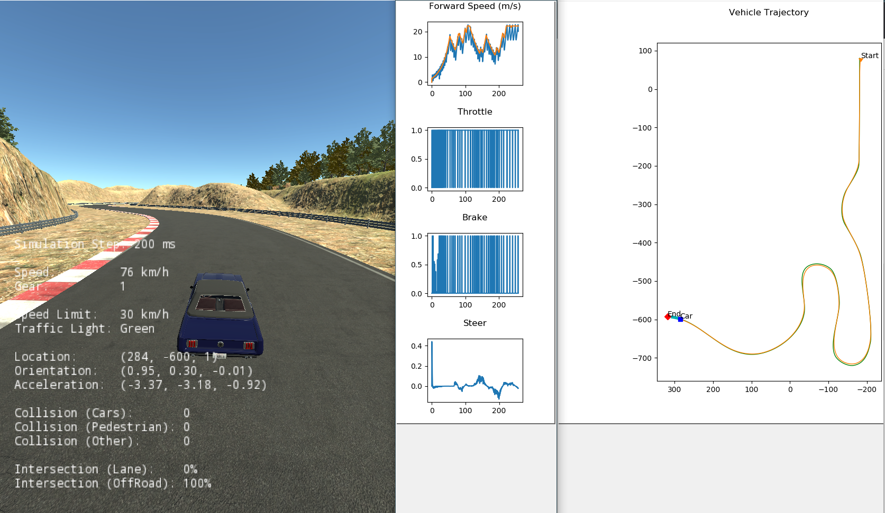
                                    

## Part 2 - State Estimation and Localization
###### **Trajectory Estimation using fusion of range and bearing measurements through Extended Kalman Filter** (https://rb.gy/7xagpm)
 

###### **Vehicle State Estimation on a Roadway using Error-State EKF** (https://rb.gy/7rgac1)

  
   

## Part 3 - Visual Perception for Self-Driving Cars
###### **Applying Stereo Depth to a Driving Scenario** (https://rb.gy/spligv)
- Obstacle detection using disparity map, depth map and, cross-corelation matrix computations.

  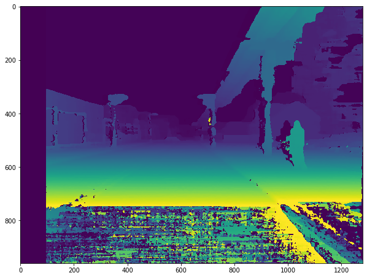
  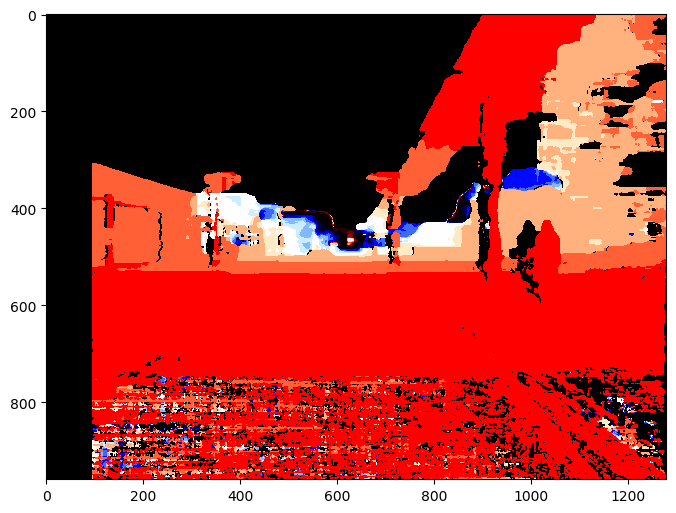
  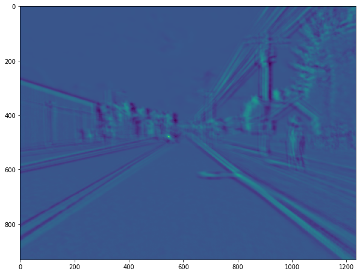
  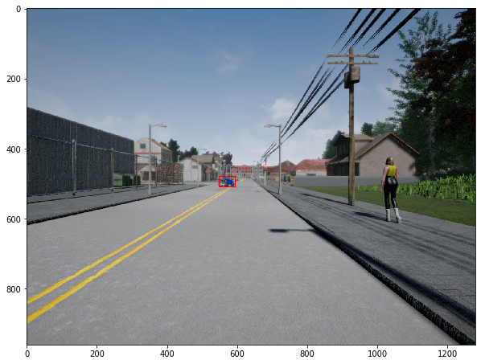

###### **Visual Odometry for Localization in Autonomous Driving** (https://rb.gy/9vqt9k)

  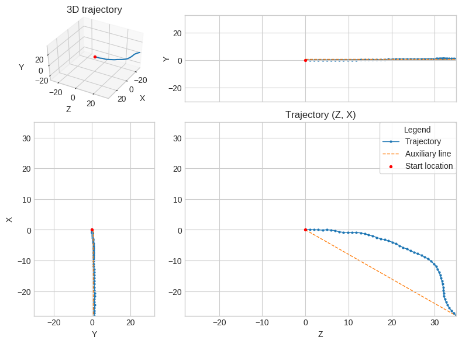

###### Environment Perception For Self-Driving Cars (https://rb.gy/vbx5cw)
- Estimation of ground plane using RANSAC algorithm

  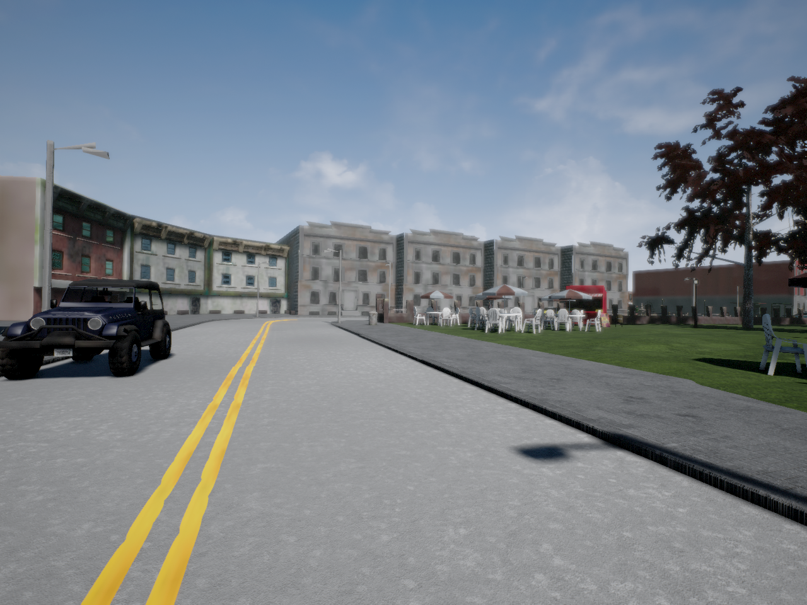
  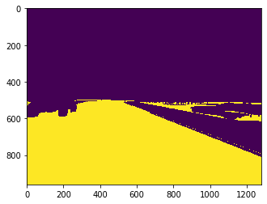

- Lane line detection using Canny edge detection, Hough transform and,merging & filtering.

  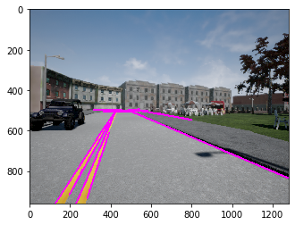
  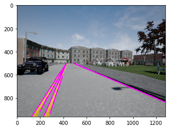
  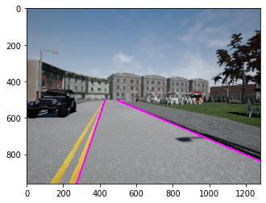

- Filtering 2D detection output using Semantic Segmentation results.

  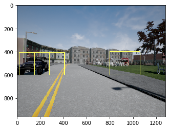
  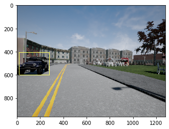

- Distance to impact estimation.

  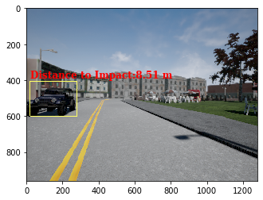

## Part 4 - Motion Planning for Self-Driving Cars 
###### **Occupany Grid Mapping for Planning using Laser Scanner** (https://rb.gy/cj1i2o)

###### **Motion Planning Pipeline for Self-Driving Cars** (https://rb.gy/9nkqjx)

